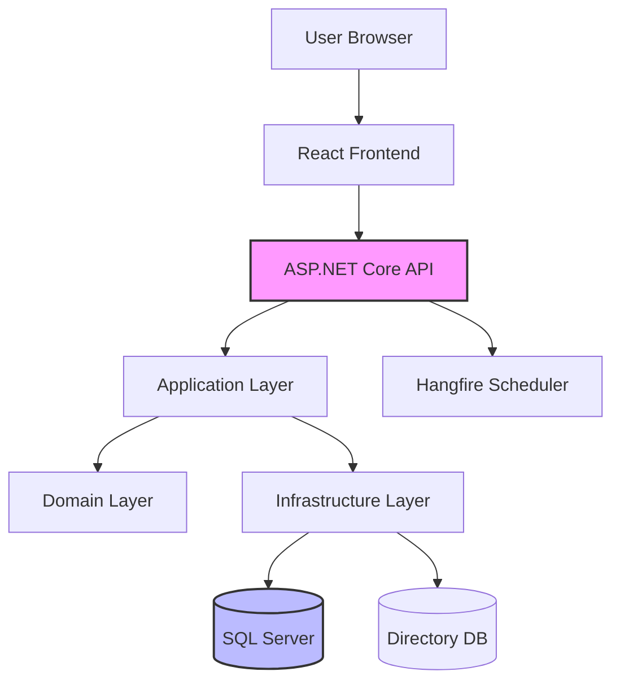

# JIRA Templates für KI-Agent-gesteuerte Entwicklung
## WEG Management System (WMS)

**Version:** 1.0
**Datum:** 8. November 2025
**Autor:** System Architecture Team
**Zweck:** Standardisierte JIRA-Ticket-Templates für die Entwicklung durch KI-Agenten

---

## 📚 Inhaltsverzeichnis

1. [Einleitung](#einleitung)
2. [Hierarchie-Struktur](#hierarchie-struktur)
3. [Template-Übersicht](#template-übersicht)
4. [Epic-Template](#epic-template)
5. [Story-Template](#story-template)
6. [Task-Templates](#task-templates)
   - Backend-Entwicklung
   - Frontend-Entwicklung
   - Infrastruktur
   - Testing
7. [Subtask-Template](#subtask-template)
8. [Best Practices für KI-Agenten](#best-practices-für-ki-agenten)
9. [Beispiel-Anwendung](#beispiel-anwendung)

---

## 🎯 Einleitung

### Zweck dieser Templates

Diese Templates sind speziell für die **Entwicklung durch KI-Agenten** (wie Claude, GPT-4, Copilot) optimiert und bieten:

- **Maximale Klarheit:** Explizite Code-Beispiele statt vager Beschreibungen
- **Vollständige Kontext:** Alle notwendigen Informationen in einem Ticket
- **Reproduzierbarkeit:** Klare Akzeptanzkriterien und Testanweisungen
- **Standardisierung:** Einheitliche Struktur über alle Module hinweg

### Zielgruppe

- **KI-Entwicklungsagenten:** Primäre Zielgruppe für automatisierte Code-Generierung
- **Menschliche Entwickler:** Als Referenz und für Code-Reviews
- **Projektmanager:** Für Planung und Tracking
- **QA-Teams:** Für Testplanung

### Voraussetzungen

Bevor du diese Templates verwendest, stelle sicher:
- [ ] Confluence-Dokumentation für WEG-1 bis WEG-9 ist verfügbar
- [ ] Technischer Stack ist definiert (.NET 8, React, SQL Server)
- [ ] Naming Conventions (WEG-19) sind dokumentiert
- [ ] Git-Repository ist initialisiert

---

## 🏗️ Hierarchie-Struktur

```
Epic (Modul-Ebene, z.B. WEG-1)
├── Story (Feature-Ebene, z.B. WEG-10)
│   ├── Task (Implementierungs-Ebene, z.B. WEG-10-1)
│   │   ├── Subtask (Code-Unit-Ebene, z.B. WEG-10-1-A)
│   │   └── Subtask (Code-Unit-Ebene, z.B. WEG-10-1-B)
│   └── Task (Implementierungs-Ebene, z.B. WEG-10-2)
└── Story (Feature-Ebene, z.B. WEG-11)
```

### Nummerierung

- **Epic:** `WEG-{X}` (z.B. WEG-1, WEG-2, ..., WEG-9)
- **Story:** `WEG-{X}{Y}` (z.B. WEG-10, WEG-11, ..., WEG-19)
- **Task:** `WEG-{XY}-{Z}` (z.B. WEG-10-1, WEG-10-2)
- **Subtask:** `WEG-{XY}-{Z}-{A}` (z.B. WEG-10-1-A)

---

## 📋 Template-Übersicht

| Template-Typ | Verwendung | Detailgrad | Geschätzte Größe |
|--------------|------------|------------|------------------|
| Epic         | Modul-Übersicht | Hoch-Level | 500-1000 LOC beschrieben |
| Story        | Feature-Implementierung | Mittel-Level | 200-500 LOC beschrieben |
| Task         | Konkrete Implementierung | Detail-Level | 50-200 LOC beschrieben |
| Subtask      | Code-Unit (Tests, etc.) | Code-Level | 20-100 LOC beschrieben |

---

## 📄 Epic-Template

### Verwendung
Beschreibt ein vollständiges Modul (z.B. WEG-1 Platform Foundation, WEG-4 Property & People).

### Template

```markdown
# [WEG-{X}] – {Modul-Name}

## 🎯 Executive Summary

{1-2 Sätze: Was ist der Business-Value dieses Moduls?}

**Beispiel:**
WEG-1 – Platform Foundation bildet das technische Fundament des gesamten WMS.
Es stellt die Infrastruktur, APIs, Logging, Fehlerbehandlung und Basis-Services
für alle nachgelagerten Module bereit.

---

## 📦 Scope & Objectives

### ✅ In Scope (MVP)
- {Feature 1 - z.B. Docker Compose Setup}
- {Feature 2 - z.B. OpenAPI Documentation}
- {Feature 3 - z.B. Structured Logging}
- {Feature 4 - z.B. Health Checks}

### ❌ Out of Scope (MVP)
- {Was explizit NICHT Teil ist - z.B. Cloud Deployment}
- {Was für Phase 2 geplant ist - z.B. Prometheus Monitoring}

---

## 🏛️ Architecture Overview

### Tech Stack
```yaml
Backend:
  - Framework: .NET 8 (ASP.NET Core)
  - ORM: Entity Framework Core 8
  - Patterns: CQRS, Repository, Domain-Driven Design
  - Validation: FluentValidation
  - Logging: Serilog

Frontend:
  - Framework: React 18
  - Language: TypeScript 5
  - Build Tool: Vite 5
  - State Management: TanStack Query v5
  - UI Library: Material-UI v5 / Tailwind CSS

Database:
  - RDBMS: SQL Server 2022
  - Schema Pattern: Multi-Schema (1 Schema pro WEG)
  - Migration: EF Core Migrations

Infrastructure:
  - Container: Docker + Docker Compose
  - CI/CD: GitHub Actions
  - Testing: xUnit, Playwright, Vitest
```

### System Context Diagram


### Domain Model (Kern-Entities)
```csharp
namespace WegManagement.Domain.Entities;

/// <summary>
/// Basis-Entity mit Audit-Feldern
/// </summary>
public abstract class BaseEntity
{
    public DateTime CreatedAt { get; set; }
    public string CreatedBy { get; set; } = string.Empty;
    public DateTime? UpdatedAt { get; set; }
    public string? UpdatedBy { get; set; }
}

/// <summary>
/// Hauptentität: {Beschreibung}
/// </summary>
public class {MainEntity} : BaseEntity
{
    public Guid Id { get; private set; }
    public string Name { get; private set; } = string.Empty;

    // Factory method
    public static {MainEntity} Create(string name)
    {
        return new {MainEntity}
        {
            Id = Guid.NewGuid(),
            Name = name,
            CreatedAt = DateTime.UtcNow
        };
    }
}
```

### API Contracts (High-Level)
```
Core Endpoints:
  GET    /api/v1/{resource}                    - List all
  GET    /api/v1/{resource}/{id}               - Get by ID
  POST   /api/v1/{resource}                    - Create
  PUT    /api/v1/{resource}/{id}               - Update
  DELETE /api/v1/{resource}/{id}               - Delete
  GET    /api/v1/{resource}/{id}/history       - Get audit history
```

---

## 🔗 Dependencies

### ⬇️ Requires (Blockers)
- [ ] WEG-{X} – {Dependency Module} (z.B. WEG-10 für WEG-11)
- [ ] Infrastructure Setup Complete
- [ ] Database Schema Defined

### ⬆️ Provides (Enables)
- WEG-{A} – {Dependent Module}
- WEG-{B} – {Dependent Module}

---

## ⚡ Non-Functional Requirements

### Performance
- API Response Time: < 200ms (95th percentile)
- Database Query Time: < 50ms (average)
- Frontend Initial Load: < 2s
- Concurrent Users: 100+ per WEG

### Security
- Authentication: Required for all endpoints (except /health, /swagger)
- Authorization: RBAC with role-based policies
- Input Validation: All inputs validated and sanitized
- SQL Injection Protection: Parameterized queries only

### Logging & Monitoring
- Structured JSON Logs with correlation IDs
- Log Level: Information (Production), Debug (Development)
- All exceptions logged with stack traces
- Performance metrics for all API calls

### Testing
- Unit Test Coverage: Minimum 80%
- Integration Tests: All API endpoints
- E2E Tests: Critical user journeys
- Performance Tests: Load testing for key endpoints

---

## ✅ Acceptance Criteria (Epic-Level)

- [ ] All child Stories completed and merged to main
- [ ] All integration tests passing (100%)
- [ ] Unit test coverage ≥ 80%
- [ ] OpenAPI documentation complete and accurate
- [ ] README documentation updated
- [ ] Security review passed
- [ ] Performance benchmarks met
- [ ] Code review completed and approved
- [ ] Deployed to staging environment
- [ ] QA sign-off received

---

## 📚 Links & References

- **Confluence:** [Link zur Confluence-Dokumentation]
- **Architecture Decision Records (ADRs):** [Link to ADR documents]
- **API Documentation:** http://localhost:5000/swagger
- **Repository:** [GitHub Repository URL]
- **Design Figma:** [Link to Figma designs]

---

## 📊 Metrics & KPIs

| Metric | Target | Current | Status |
|--------|--------|---------|--------|
| Code Coverage | ≥ 80% | - | 🔴 Pending |
| API Response Time (p95) | < 200ms | - | 🔴 Pending |
| Bug Count | < 5 critical | - | 🔴 Pending |
| Stories Completed | 100% | 0% | 🔴 Pending |

---

## 🚀 Rollout Plan

### Phase 1: Foundation (Week 1-2)
- [ ] Setup project structure
- [ ] Configure Docker Compose
- [ ] Implement logging & health checks

### Phase 2: Core Features (Week 3-4)
- [ ] Implement domain entities
- [ ] Create API endpoints
- [ ] Build frontend components

### Phase 3: Testing & QA (Week 5)
- [ ] Write integration tests
- [ ] Perform security review
- [ ] Load testing

### Phase 4: Deployment (Week 6)
- [ ] Deploy to staging
- [ ] QA testing
- [ ] Production deployment

```

---

## 📄 Story-Template

### Verwendung
Beschreibt ein Feature innerhalb eines Moduls (z.B. WEG-10 Solution Setup, WEG-11 API & OpenAPI).

### Template

```markdown
# [WEG-{X}{Y}] – {Story-Name}

## 👤 User Story

**As a** {Role (z.B. Developer, Backend Engineer, DevOps Engineer)}
**I want** {Goal/Capability}
**So that** {Business Value / Benefit}

**Beispiel:**
**As a** Backend Developer
**I want** a standardized project structure with clear separation of concerns
**So that** I can quickly understand the codebase and add new features consistently

---

## 📖 Context & Background

{2-4 Sätze: Warum ist diese Story wichtig? Welches Problem löst sie?
Welche Geschäftsanforderungen erfüllt sie?}

**Beispiel:**
The solution structure defines how code is organized across the project. A well-structured
project following Domain-Driven Design principles makes it easier for developers to locate
code, understand dependencies, and maintain consistency. This story establishes the foundation
that all subsequent development will build upon.

---

## 🛠️ Technical Approach

### Solution Design

{Beschreibung der technischen Lösung - Architektur, Patterns, Libraries}

**Beispiel:**
We will implement a clean architecture with the following layers:
- **Api Layer:** Controllers, middleware, authentication
- **Application Layer:** CQRS handlers, DTOs, validators
- **Domain Layer:** Entities, value objects, domain services
- **Infrastructure Layer:** EF Core, repositories, external services

Each layer will reside in a separate project with clear dependency rules
(Domain has no dependencies, Infrastructure depends on Domain, etc.).

### File & Folder Structure
```
src/
├── WegManagement.Api/
│   ├── Controllers/
│   │   └── {Resource}Controller.cs
│   ├── Middleware/
│   │   ├── ErrorHandlingMiddleware.cs
│   │   └── CorrelationIdMiddleware.cs
│   ├── Program.cs
│   └── appsettings.json
│
├── WegManagement.Application/
│   ├── Common/
│   │   ├── Interfaces/
│   │   └── Behaviors/
│   ├── {Feature}/
│   │   ├── Commands/
│   │   │   ├── Create{Resource}Command.cs
│   │   │   └── Create{Resource}CommandHandler.cs
│   │   ├── Queries/
│   │   │   ├── Get{Resource}Query.cs
│   │   │   └── Get{Resource}QueryHandler.cs
│   │   └── DTOs/
│   │       ├── {Resource}Dto.cs
│   │       └── Create{Resource}Request.cs
│   └── DependencyInjection.cs
│
├── WegManagement.Domain/
│   ├── Common/
│   │   └── BaseEntity.cs
│   ├── Entities/
│   │   └── {Resource}.cs
│   ├── ValueObjects/
│   ├── Enums/
│   └── Exceptions/
│       └── {Domain}Exception.cs
│
├── WegManagement.Infrastructure/
│   ├── Persistence/
│   │   ├── ApplicationDbContext.cs
│   │   ├── Configurations/
│   │   │   └── {Resource}Configuration.cs
│   │   └── Migrations/
│   ├── Repositories/
│   │   └── {Resource}Repository.cs
│   └── DependencyInjection.cs
│
└── WegManagement.Directory/
    ├── DirectoryDbContext.cs
    └── Entities/
        └── Association.cs
```

### Data Model
```csharp
using System;
using System.Collections.Generic;
using WegManagement.Domain.Common;

namespace WegManagement.Domain.Entities;

/// <summary>
/// Represents {description of entity}
/// </summary>
public class {Resource} : BaseEntity
{
    // Primary Key
    public Guid Id { get; private set; }

    // Required Properties
    public string Name { get; private set; } = string.Empty;
    public string Description { get; private set; } = string.Empty;

    // Optional Properties
    public string? Notes { get; private set; }

    // Enums
    public {Resource}Status Status { get; private set; }

    // Foreign Keys
    public Guid AssociationId { get; private set; }

    // Navigation Properties
    public virtual Association Association { get; private set; } = null!;
    public virtual ICollection<{Related}> {Relations} { get; private set; }

    // Private constructor for EF Core
    private {Resource}()
    {
        {Relations} = new HashSet<{Related}>();
    }

    // Factory Method (Primary way to create instances)
    public static {Resource} Create(
        string name,
        string description,
        Guid associationId)
    {
        // Input validation
        if (string.IsNullOrWhiteSpace(name))
            throw new ArgumentException("Name cannot be empty", nameof(name));

        if (name.Length > 200)
            throw new ArgumentException("Name cannot exceed 200 characters", nameof(name));

        if (associationId == Guid.Empty)
            throw new ArgumentException("AssociationId cannot be empty", nameof(associationId));

        return new {Resource}
        {
            Id = Guid.NewGuid(),
            Name = name.Trim(),
            Description = description?.Trim() ?? string.Empty,
            Status = {Resource}Status.Active,
            AssociationId = associationId,
            CreatedAt = DateTime.UtcNow,
            CreatedBy = "System" // Will be set by infrastructure
        };
    }

    // Business Logic Methods
    public void UpdateDetails(string name, string description)
    {
        if (string.IsNullOrWhiteSpace(name))
            throw new ArgumentException("Name cannot be empty", nameof(name));

        if (name.Length > 200)
            throw new ArgumentException("Name cannot exceed 200 characters", nameof(name));

        Name = name.Trim();
        Description = description?.Trim() ?? string.Empty;
        UpdatedAt = DateTime.UtcNow;
    }

    public void Deactivate()
    {
        if (Status == {Resource}Status.Archived)
            throw new InvalidOperationException("Cannot deactivate an archived resource");

        Status = {Resource}Status.Inactive;
        UpdatedAt = DateTime.UtcNow;
    }

    public void Archive()
    {
        Status = {Resource}Status.Archived;
        UpdatedAt = DateTime.UtcNow;
    }
}

/// <summary>
/// Status enumeration for {Resource}
/// </summary>
public enum {Resource}Status
{
    Active = 1,
    Inactive = 2,
    Archived = 3
}
```

### DTOs & Requests
```csharp
namespace WegManagement.Application.{Feature}.DTOs;

/// <summary>
/// DTO for {Resource} entity
/// </summary>
public record {Resource}Dto(
    Guid Id,
    string Name,
    string Description,
    string Status,
    Guid AssociationId,
    DateTime CreatedAt,
    string CreatedBy,
    DateTime? UpdatedAt,
    string? UpdatedBy
);

/// <summary>
/// Request for creating a new {Resource}
/// </summary>
public record Create{Resource}Request(
    string Name,
    string Description,
    Guid AssociationId
);

/// <summary>
/// Request for updating a {Resource}
/// </summary>
public record Update{Resource}Request(
    string Name,
    string Description
);
```

### API Specification
```yaml
openapi: 3.0.0
info:
  title: {Resource} API
  version: v1

paths:
  /api/v1/{resources}:
    get:
      summary: Get all {resources}
      operationId: GetAll{Resources}
      parameters:
        - name: page
          in: query
          schema:
            type: integer
            default: 1
        - name: pageSize
          in: query
          schema:
            type: integer
            default: 20
        - name: status
          in: query
          schema:
            type: string
            enum: [Active, Inactive, Archived]
      responses:
        '200':
          description: Success
          content:
            application/json:
              schema:
                type: object
                properties:
                  items:
                    type: array
                    items:
                      $ref: '#/components/schemas/{Resource}Dto'
                  totalCount:
                    type: integer
                  page:
                    type: integer
                  pageSize:
                    type: integer
        '401':
          $ref: '#/components/responses/Unauthorized'

    post:
      summary: Create new {resource}
      operationId: Create{Resource}
      requestBody:
        required: true
        content:
          application/json:
            schema:
              $ref: '#/components/schemas/Create{Resource}Request'
      responses:
        '201':
          description: Created
          content:
            application/json:
              schema:
                $ref: '#/components/schemas/{Resource}Dto'
        '400':
          $ref: '#/components/responses/ValidationError'
        '401':
          $ref: '#/components/responses/Unauthorized'

  /api/v1/{resources}/{id}:
    get:
      summary: Get {resource} by ID
      operationId: Get{Resource}ById
      parameters:
        - name: id
          in: path
          required: true
          schema:
            type: string
            format: uuid
      responses:
        '200':
          description: Success
          content:
            application/json:
              schema:
                $ref: '#/components/schemas/{Resource}Dto'
        '404':
          $ref: '#/components/responses/NotFound'
        '401':
          $ref: '#/components/responses/Unauthorized'

    put:
      summary: Update {resource}
      operationId: Update{Resource}
      parameters:
        - name: id
          in: path
          required: true
          schema:
            type: string
            format: uuid
      requestBody:
        required: true
        content:
          application/json:
            schema:
              $ref: '#/components/schemas/Update{Resource}Request'
      responses:
        '200':
          description: Success
          content:
            application/json:
              schema:
                $ref: '#/components/schemas/{Resource}Dto'
        '400':
          $ref: '#/components/responses/ValidationError'
        '404':
          $ref: '#/components/responses/NotFound'

    delete:
      summary: Delete {resource}
      operationId: Delete{Resource}
      parameters:
        - name: id
          in: path
          required: true
          schema:
            type: string
            format: uuid
      responses:
        '204':
          description: No Content
        '404':
          $ref: '#/components/responses/NotFound'

components:
  schemas:
    {Resource}Dto:
      type: object
      properties:
        id:
          type: string
          format: uuid
        name:
          type: string
        description:
          type: string
        status:
          type: string
          enum: [Active, Inactive, Archived]
        associationId:
          type: string
          format: uuid
        createdAt:
          type: string
          format: date-time
        createdBy:
          type: string

    Create{Resource}Request:
      type: object
      required:
        - name
        - associationId
      properties:
        name:
          type: string
          minLength: 1
          maxLength: 200
        description:
          type: string
          maxLength: 2000
        associationId:
          type: string
          format: uuid

  responses:
    ValidationError:
      description: Validation error
      content:
        application/json:
          schema:
            $ref: '#/components/schemas/ProblemDetails'

    NotFound:
      description: Resource not found
      content:
        application/json:
          schema:
            $ref: '#/components/schemas/ProblemDetails'

    Unauthorized:
      description: Unauthorized
```

---

## ✅ Acceptance Criteria (BDD-Style)

### Scenario 1: Create {Resource} Successfully
**Given** I am an authenticated user with "Manager" role
**And** I have a valid AssociationId
**When** I send a POST request to `/api/v1/{resources}` with valid data:
```json
{
  "name": "Test Resource",
  "description": "Test Description",
  "associationId": "3fa85f64-5717-4562-b3fc-2c963f66afa6"
}
```
**Then** the response status code should be 201 (Created)
**And** the response body should contain the created resource with a generated ID
**And** the resource should be persisted in the database
**And** the audit fields (CreatedAt, CreatedBy) should be populated
**And** the operation should be logged with correlation ID

### Scenario 2: Validation Error - Empty Name
**Given** I am an authenticated user
**When** I send a POST request with an empty name:
```json
{
  "name": "",
  "description": "Test Description",
  "associationId": "3fa85f64-5717-4562-b3fc-2c963f66afa6"
}
```
**Then** the response status code should be 400 (Bad Request)
**And** the response should contain validation error details
**And** the error message should indicate "Name cannot be empty"
**And** no record should be created in the database

### Scenario 3: Get {Resource} by ID
**Given** a {resource} exists with ID "abc123"
**When** I send a GET request to `/api/v1/{resources}/abc123`
**Then** the response status code should be 200 (OK)
**And** the response body should contain the correct resource data
**And** all navigation properties should be populated (if included)

### Scenario 4: Update {Resource}
**Given** a {resource} exists with ID "abc123"
**When** I send a PUT request to `/api/v1/{resources}/abc123` with:
```json
{
  "name": "Updated Name",
  "description": "Updated Description"
}
```
**Then** the response status code should be 200 (OK)
**And** the resource should be updated in the database
**And** the UpdatedAt field should be set to current timestamp
**And** the UpdatedBy field should be set to current user

### Scenario 5: Delete {Resource}
**Given** a {resource} exists with ID "abc123"
**When** I send a DELETE request to `/api/v1/{resources}/abc123`
**Then** the response status code should be 204 (No Content)
**And** the resource status should be set to "Archived" (soft delete)
**And** the resource should still exist in the database

### Scenario 6: Unauthorized Access
**Given** I am not authenticated
**When** I send any request to `/api/v1/{resources}`
**Then** the response status code should be 401 (Unauthorized)

---

## 🧪 Testing Requirements

### Unit Tests (Minimum Coverage: 80%)
- [ ] Domain entity factory methods
- [ ] Domain entity business logic methods
- [ ] Command/Query handlers
- [ ] Validators (FluentValidation)
- [ ] Mapping logic (Entity ↔ DTO)

### Integration Tests (All Endpoints)
- [ ] GET /api/v1/{resources} - List all
- [ ] GET /api/v1/{resources}/{id} - Get by ID
- [ ] POST /api/v1/{resources} - Create
- [ ] PUT /api/v1/{resources}/{id} - Update
- [ ] DELETE /api/v1/{resources}/{id} - Delete
- [ ] Authorization checks for each endpoint
- [ ] Database transactions and rollback

### E2E Tests (Critical Paths)
- [ ] Complete CRUD workflow
- [ ] Error handling scenarios
- [ ] Pagination and filtering

---

## 📝 Implementation Checklist

### Backend
- [ ] Domain entity created with factory method
- [ ] Entity configuration (EF Core) created
- [ ] Database migration generated and applied
- [ ] Repository interface and implementation
- [ ] CQRS Commands created (Create, Update, Delete)
- [ ] CQRS Queries created (GetAll, GetById)
- [ ] Command/Query handlers implemented
- [ ] FluentValidation validators created
- [ ] DTOs and mapping configured
- [ ] API controller implemented
- [ ] OpenAPI documentation annotations added
- [ ] Unit tests written (≥ 80% coverage)
- [ ] Integration tests written

### Frontend (if applicable)
- [ ] TypeScript interfaces/types defined
- [ ] API client service created
- [ ] React components created
- [ ] Forms with validation
- [ ] State management (TanStack Query)
- [ ] Routing configured
- [ ] Unit tests (Vitest)
- [ ] E2E tests (Playwright)

### DevOps
- [ ] Logging implemented (Serilog)
- [ ] Error handling middleware
- [ ] Authorization policies configured
- [ ] Health checks added
- [ ] Dockerfile updated (if needed)
- [ ] CI/CD pipeline runs successfully

### Documentation
- [ ] README updated
- [ ] API documentation in Swagger
- [ ] Confluence page updated
- [ ] ADR created (if architectural decision)

### Code Review
- [ ] Code follows naming conventions (WEG-19)
- [ ] No code smells (SonarQube clean)
- [ ] Security review passed
- [ ] Performance acceptable
- [ ] PR approved by 2+ reviewers

---

## 🔗 Dependencies

### Blocked By
- [ ] {Story ID} – {Story Name}
- [ ] Infrastructure setup complete
- [ ] Database schema available

### Blocks
- [ ] {Story ID} – {Story Name}

---

## 📚 Links & References

- **Confluence Documentation:** [Link]
- **Figma Design:** [Link]
- **OpenAPI Spec:** http://localhost:5000/swagger
- **Related Stories:** [{Story IDs}]

---

## 🎯 Definition of Done

- [ ] All acceptance criteria met
- [ ] All tests passing (Unit, Integration, E2E)
- [ ] Code coverage ≥ 80%
- [ ] Code reviewed and approved
- [ ] Documentation complete
- [ ] Security review passed
- [ ] Deployed to staging
- [ ] QA sign-off

```

---

## 📄 Task-Templates

### Backend Task Template

```markdown
# [WEG-{XY}-{Z}] – {Task Name}

## 🎯 Objective

{1 Satz: Was soll implementiert werden?}

**Beispiel:**
Implement the Domain Entity for {Resource} with factory methods, business logic,
and validation rules.

---

## 📁 Files to Create/Modify

```
src/WegManagement.Domain/Entities/{Resource}.cs
src/WegManagement.Domain/Enums/{Resource}Status.cs
tests/WegManagement.Domain.Tests/Entities/{Resource}Tests.cs
```

---

## 💻 Implementation Details

### File: `src/WegManagement.Domain/Entities/{Resource}.cs`

```csharp
using System;
using System.Collections.Generic;
using WegManagement.Domain.Common;
using WegManagement.Domain.Enums;

namespace WegManagement.Domain.Entities;

/// <summary>
/// Represents a {description of the resource}
/// Used for {business purpose}
/// </summary>
public class {Resource} : BaseEntity
{
    #region Properties

    /// <summary>
    /// Unique identifier for the {resource}
    /// </summary>
    public Guid Id { get; private set; }

    /// <summary>
    /// Name of the {resource} (required, max 200 characters)
    /// </summary>
    public string Name { get; private set; } = string.Empty;

    /// <summary>
    /// Detailed description (optional, max 2000 characters)
    /// </summary>
    public string Description { get; private set; } = string.Empty;

    /// <summary>
    /// Current status of the {resource}
    /// </summary>
    public {Resource}Status Status { get; private set; }

    /// <summary>
    /// Reference to the owning Association (WEG)
    /// </summary>
    public Guid AssociationId { get; private set; }

    #endregion

    #region Navigation Properties

    /// <summary>
    /// The Association (WEG) this {resource} belongs to
    /// </summary>
    public virtual Association Association { get; private set; } = null!;

    /// <summary>
    /// Related {entities} collection
    /// </summary>
    public virtual ICollection<{RelatedEntity}> {Relations} { get; private set; }

    #endregion

    #region Constructors

    /// <summary>
    /// Private constructor for EF Core
    /// </summary>
    private {Resource}()
    {
        {Relations} = new HashSet<{RelatedEntity}>();
    }

    #endregion

    #region Factory Methods

    /// <summary>
    /// Creates a new {Resource} instance
    /// </summary>
    /// <param name="name">Name of the {resource}</param>
    /// <param name="description">Description of the {resource}</param>
    /// <param name="associationId">ID of the owning Association</param>
    /// <returns>New {Resource} instance</returns>
    /// <exception cref="ArgumentException">Thrown when validation fails</exception>
    public static {Resource} Create(
        string name,
        string description,
        Guid associationId)
    {
        // Validate inputs
        ValidateName(name);
        ValidateDescription(description);
        ValidateAssociationId(associationId);

        return new {Resource}
        {
            Id = Guid.NewGuid(),
            Name = name.Trim(),
            Description = description?.Trim() ?? string.Empty,
            Status = {Resource}Status.Active,
            AssociationId = associationId,
            CreatedAt = DateTime.UtcNow,
            CreatedBy = "System" // Will be overridden by infrastructure
        };
    }

    #endregion

    #region Business Logic Methods

    /// <summary>
    /// Updates the name and description
    /// </summary>
    public void UpdateDetails(string name, string description)
    {
        ValidateName(name);
        ValidateDescription(description);

        Name = name.Trim();
        Description = description?.Trim() ?? string.Empty;
        UpdatedAt = DateTime.UtcNow;
    }

    /// <summary>
    /// Deactivates the {resource}
    /// </summary>
    public void Deactivate()
    {
        if (Status == {Resource}Status.Archived)
            throw new InvalidOperationException(
                "Cannot deactivate an archived {resource}");

        Status = {Resource}Status.Inactive;
        UpdatedAt = DateTime.UtcNow;
    }

    /// <summary>
    /// Reactivates an inactive {resource}
    /// </summary>
    public void Reactivate()
    {
        if (Status == {Resource}Status.Archived)
            throw new InvalidOperationException(
                "Cannot reactivate an archived {resource}");

        Status = {Resource}Status.Active;
        UpdatedAt = DateTime.UtcNow;
    }

    /// <summary>
    /// Archives the {resource} (soft delete)
    /// </summary>
    public void Archive()
    {
        Status = {Resource}Status.Archived;
        UpdatedAt = DateTime.UtcNow;
    }

    #endregion

    #region Validation Methods

    private static void ValidateName(string name)
    {
        if (string.IsNullOrWhiteSpace(name))
            throw new ArgumentException(
                "Name cannot be empty", nameof(name));

        if (name.Length > 200)
            throw new ArgumentException(
                "Name cannot exceed 200 characters", nameof(name));
    }

    private static void ValidateDescription(string description)
    {
        if (description?.Length > 2000)
            throw new ArgumentException(
                "Description cannot exceed 2000 characters",
                nameof(description));
    }

    private static void ValidateAssociationId(Guid associationId)
    {
        if (associationId == Guid.Empty)
            throw new ArgumentException(
                "AssociationId cannot be empty",
                nameof(associationId));
    }

    #endregion
}
```

### File: `src/WegManagement.Domain/Enums/{Resource}Status.cs`

```csharp
namespace WegManagement.Domain.Enums;

/// <summary>
/// Status enumeration for {Resource}
/// </summary>
public enum {Resource}Status
{
    /// <summary>
    /// {Resource} is active and in use
    /// </summary>
    Active = 1,

    /// <summary>
    /// {Resource} is temporarily inactive
    /// </summary>
    Inactive = 2,

    /// <summary>
    /// {Resource} is archived (soft deleted)
    /// </summary>
    Archived = 3
}
```

---

## ✅ Acceptance Criteria

- [ ] {Resource} entity created with all required properties
- [ ] Factory method `Create()` implemented with validation
- [ ] Business logic methods implemented (Update, Deactivate, Archive)
- [ ] All validation rules enforced
- [ ] Navigation properties configured
- [ ] XML documentation comments complete
- [ ] Unit tests cover all methods (≥ 90% coverage)
- [ ] No compiler warnings
- [ ] Code follows naming conventions (WEG-19)

---

## 🧪 Testing Instructions

### File: `tests/WegManagement.Domain.Tests/Entities/{Resource}Tests.cs`

```csharp
using System;
using Xunit;
using WegManagement.Domain.Entities;
using WegManagement.Domain.Enums;

namespace WegManagement.Domain.Tests.Entities;

public class {Resource}Tests
{
    private readonly Guid _validAssociationId = Guid.NewGuid();

    #region Create Tests

    [Fact]
    public void Create_WithValidData_ShouldSucceed()
    {
        // Arrange
        var name = "Test {Resource}";
        var description = "Test Description";

        // Act
        var result = {Resource}.Create(name, description, _validAssociationId);

        // Assert
        Assert.NotNull(result);
        Assert.NotEqual(Guid.Empty, result.Id);
        Assert.Equal(name, result.Name);
        Assert.Equal(description, result.Description);
        Assert.Equal({Resource}Status.Active, result.Status);
        Assert.Equal(_validAssociationId, result.AssociationId);
        Assert.True(result.CreatedAt <= DateTime.UtcNow);
    }

    [Theory]
    [InlineData(null)]
    [InlineData("")]
    [InlineData("   ")]
    public void Create_WithInvalidName_ShouldThrowArgumentException(
        string invalidName)
    {
        // Arrange
        var description = "Description";

        // Act & Assert
        var exception = Assert.Throws<ArgumentException>(() =>
            {Resource}.Create(invalidName, description, _validAssociationId));

        Assert.Equal("name", exception.ParamName);
        Assert.Contains("cannot be empty", exception.Message);
    }

    [Fact]
    public void Create_WithNameTooLong_ShouldThrowArgumentException()
    {
        // Arrange
        var nameTooLong = new string('A', 201);
        var description = "Description";

        // Act & Assert
        var exception = Assert.Throws<ArgumentException>(() =>
            {Resource}.Create(nameTooLong, description, _validAssociationId));

        Assert.Equal("name", exception.ParamName);
        Assert.Contains("cannot exceed 200 characters", exception.Message);
    }

    [Fact]
    public void Create_WithEmptyAssociationId_ShouldThrowArgumentException()
    {
        // Arrange
        var name = "Test";
        var description = "Description";

        // Act & Assert
        var exception = Assert.Throws<ArgumentException>(() =>
            {Resource}.Create(name, description, Guid.Empty));

        Assert.Equal("associationId", exception.ParamName);
    }

    #endregion

    #region UpdateDetails Tests

    [Fact]
    public void UpdateDetails_WithValidData_ShouldUpdateFields()
    {
        // Arrange
        var resource = {Resource}.Create("Old Name", "Old Desc", _validAssociationId);
        var newName = "New Name";
        var newDescription = "New Description";
        var oldUpdatedAt = resource.UpdatedAt;

        // Act
        resource.UpdateDetails(newName, newDescription);

        // Assert
        Assert.Equal(newName, resource.Name);
        Assert.Equal(newDescription, resource.Description);
        Assert.NotNull(resource.UpdatedAt);
        Assert.NotEqual(oldUpdatedAt, resource.UpdatedAt);
    }

    [Fact]
    public void UpdateDetails_WithInvalidName_ShouldThrowArgumentException()
    {
        // Arrange
        var resource = {Resource}.Create("Name", "Desc", _validAssociationId);

        // Act & Assert
        Assert.Throws<ArgumentException>(() =>
            resource.UpdateDetails("", "New Description"));
    }

    #endregion

    #region Status Transition Tests

    [Fact]
    public void Deactivate_WhenActive_ShouldSetStatusToInactive()
    {
        // Arrange
        var resource = {Resource}.Create("Name", "Desc", _validAssociationId);

        // Act
        resource.Deactivate();

        // Assert
        Assert.Equal({Resource}Status.Inactive, resource.Status);
        Assert.NotNull(resource.UpdatedAt);
    }

    [Fact]
    public void Deactivate_WhenArchived_ShouldThrowInvalidOperationException()
    {
        // Arrange
        var resource = {Resource}.Create("Name", "Desc", _validAssociationId);
        resource.Archive();

        // Act & Assert
        Assert.Throws<InvalidOperationException>(() => resource.Deactivate());
    }

    [Fact]
    public void Reactivate_WhenInactive_ShouldSetStatusToActive()
    {
        // Arrange
        var resource = {Resource}.Create("Name", "Desc", _validAssociationId);
        resource.Deactivate();

        // Act
        resource.Reactivate();

        // Assert
        Assert.Equal({Resource}Status.Active, resource.Status);
    }

    [Fact]
    public void Archive_ShouldSetStatusToArchived()
    {
        // Arrange
        var resource = {Resource}.Create("Name", "Desc", _validAssociationId);

        // Act
        resource.Archive();

        // Assert
        Assert.Equal({Resource}Status.Archived, resource.Status);
        Assert.NotNull(resource.UpdatedAt);
    }

    #endregion
}
```

---

## 🏃 Commands to Run

```bash
# Build the solution
dotnet build

# Run unit tests
dotnet test --filter "FullyQualifiedName~{Resource}Tests"

# Check code coverage
dotnet test --collect:"XPlat Code Coverage" --filter "{Resource}Tests"

# View coverage report
reportgenerator -reports:"**/coverage.cobertura.xml" -targetdir:"coveragereport" -reporttypes:Html
```

---

## ✅ Definition of Done

- [ ] Code compiles without warnings
- [ ] All unit tests passing
- [ ] Code coverage ≥ 90% for entity
- [ ] XML documentation complete
- [ ] Code follows naming conventions
- [ ] No SonarQube violations
- [ ] Peer reviewed

```

### Frontend Task Template

```markdown
# [WEG-{XY}-{Z}] – {Frontend Component/Feature Name}

## 🎯 Objective

{1 Satz: Was soll implementiert werden?}

**Beispiel:**
Create a React component for displaying and managing {Resource} with
CRUD operations and form validation.

---

## 📁 Files to Create/Modify

```
src/
├── features/{resource}/
│   ├── components/
│   │   ├── {Resource}List.tsx
│   │   ├── {Resource}Form.tsx
│   │   └── {Resource}Card.tsx
│   ├── hooks/
│   │   └── use{Resource}.ts
│   ├── api/
│   │   └── {resource}Api.ts
│   ├── types/
│   │   └── {resource}.types.ts
│   └── validation/
│       └── {resource}.schema.ts
└── __tests__/
    └── features/{resource}/
        └── {Resource}List.test.tsx
```

---

## 💻 Implementation Details

### File: `src/features/{resource}/types/{resource}.types.ts`

```typescript
/**
 * {Resource} entity from API
 */
export interface {Resource} {
  id: string;
  name: string;
  description: string;
  status: {Resource}Status;
  associationId: string;
  createdAt: string;
  createdBy: string;
  updatedAt?: string;
  updatedBy?: string;
}

/**
 * Status enumeration
 */
export enum {Resource}Status {
  Active = 'Active',
  Inactive = 'Inactive',
  Archived = 'Archived'
}

/**
 * Request for creating a new {resource}
 */
export interface Create{Resource}Request {
  name: string;
  description: string;
  associationId: string;
}

/**
 * Request for updating a {resource}
 */
export interface Update{Resource}Request {
  name: string;
  description: string;
}

/**
 * Paginated response
 */
export interface {Resource}ListResponse {
  items: {Resource}[];
  totalCount: number;
  page: number;
  pageSize: number;
}
```

### File: `src/features/{resource}/api/{resource}Api.ts`

```typescript
import { apiClient } from '@/lib/apiClient';
import type {
  {Resource},
  Create{Resource}Request,
  Update{Resource}Request,
  {Resource}ListResponse
} from '../types/{resource}.types';

const BASE_URL = '/api/v1/{resources}';

/**
 * API client for {Resource} operations
 */
export const {resource}Api = {
  /**
   * Get all {resources} with pagination
   */
  getAll: async (
    page = 1,
    pageSize = 20,
    status?: string
  ): Promise<{Resource}ListResponse> => {
    const params = new URLSearchParams({
      page: page.toString(),
      pageSize: pageSize.toString(),
      ...(status && { status })
    });

    const response = await apiClient.get<{Resource}ListResponse>(
      `${BASE_URL}?${params}`
    );
    return response.data;
  },

  /**
   * Get {resource} by ID
   */
  getById: async (id: string): Promise<{Resource}> => {
    const response = await apiClient.get<{Resource}>(`${BASE_URL}/${id}`);
    return response.data;
  },

  /**
   * Create new {resource}
   */
  create: async (data: Create{Resource}Request): Promise<{Resource}> => {
    const response = await apiClient.post<{Resource}>(BASE_URL, data);
    return response.data;
  },

  /**
   * Update existing {resource}
   */
  update: async (
    id: string,
    data: Update{Resource}Request
  ): Promise<{Resource}> => {
    const response = await apiClient.put<{Resource}>(
      `${BASE_URL}/${id}`,
      data
    );
    return response.data;
  },

  /**
   * Delete {resource}
   */
  delete: async (id: string): Promise<void> => {
    await apiClient.delete(`${BASE_URL}/${id}`);
  }
};
```

### File: `src/features/{resource}/validation/{resource}.schema.ts`

```typescript
import { z } from 'zod';

/**
 * Validation schema for creating/updating {resource}
 */
export const {resource}Schema = z.object({
  name: z
    .string()
    .min(1, '{Resource} name is required')
    .max(200, '{Resource} name cannot exceed 200 characters')
    .trim(),

  description: z
    .string()
    .max(2000, 'Description cannot exceed 2000 characters')
    .optional()
    .default(''),

  associationId: z
    .string()
    .uuid('Invalid association ID')
});

export type {Resource}FormData = z.infer<typeof {resource}Schema>;
```

### File: `src/features/{resource}/hooks/use{Resource}.ts`

```typescript
import { useQuery, useMutation, useQueryClient } from '@tanstack/react-query';
import { {resource}Api } from '../api/{resource}Api';
import type {
  Create{Resource}Request,
  Update{Resource}Request
} from '../types/{resource}.types';

const QUERY_KEY = ['{resources}'];

/**
 * Hook for fetching all {resources}
 */
export function use{Resources}(page = 1, pageSize = 20, status?: string) {
  return useQuery({
    queryKey: [...QUERY_KEY, { page, pageSize, status }],
    queryFn: () => {resource}Api.getAll(page, pageSize, status)
  });
}

/**
 * Hook for fetching single {resource}
 */
export function use{Resource}(id: string) {
  return useQuery({
    queryKey: [...QUERY_KEY, id],
    queryFn: () => {resource}Api.getById(id),
    enabled: !!id
  });
}

/**
 * Hook for creating {resource}
 */
export function useCreate{Resource}() {
  const queryClient = useQueryClient();

  return useMutation({
    mutationFn: (data: Create{Resource}Request) =>
      {resource}Api.create(data),
    onSuccess: () => {
      queryClient.invalidateQueries({ queryKey: QUERY_KEY });
    }
  });
}

/**
 * Hook for updating {resource}
 */
export function useUpdate{Resource}() {
  const queryClient = useQueryClient();

  return useMutation({
    mutationFn: ({ id, data }: { id: string; data: Update{Resource}Request }) =>
      {resource}Api.update(id, data),
    onSuccess: (_, variables) => {
      queryClient.invalidateQueries({ queryKey: QUERY_KEY });
      queryClient.invalidateQueries({
        queryKey: [...QUERY_KEY, variables.id]
      });
    }
  });
}

/**
 * Hook for deleting {resource}
 */
export function useDelete{Resource}() {
  const queryClient = useQueryClient();

  return useMutation({
    mutationFn: (id: string) => {resource}Api.delete(id),
    onSuccess: () => {
      queryClient.invalidateQueries({ queryKey: QUERY_KEY });
    }
  });
}
```

### File: `src/features/{resource}/components/{Resource}List.tsx`

```typescript
import React from 'react';
import { use{Resources}, useDelete{Resource} } from '../hooks/use{Resource}';
import { {Resource}Card } from './{Resource}Card';
import { LoadingSpinner } from '@/components/ui/LoadingSpinner';
import { ErrorMessage } from '@/components/ui/ErrorMessage';
import { Button } from '@/components/ui/Button';

interface {Resource}ListProps {
  onEdit: (id: string) => void;
  onCreate: () => void;
}

export const {Resource}List: React.FC<{Resource}ListProps> = ({
  onEdit,
  onCreate
}) => {
  const [page, setPage] = React.useState(1);
  const pageSize = 20;

  const { data, isLoading, error } = use{Resources}(page, pageSize);
  const delete{Resource} = useDelete{Resource}();

  const handleDelete = async (id: string) => {
    if (window.confirm('Are you sure you want to delete this {resource}?')) {
      try {
        await delete{Resource}.mutateAsync(id);
      } catch (error) {
        console.error('Failed to delete {resource}:', error);
      }
    }
  };

  if (isLoading) {
    return <LoadingSpinner />;
  }

  if (error) {
    return (
      <ErrorMessage
        title="Failed to load {resources}"
        message={error.message}
      />
    );
  }

  return (
    <div className="space-y-4">
      <div className="flex justify-between items-center">
        <h2 className="text-2xl font-bold">{Resources}</h2>
        <Button onClick={onCreate}>Create New {Resource}</Button>
      </div>

      {data?.items.length === 0 ? (
        <p className="text-gray-500">No {resources} found.</p>
      ) : (
        <div className="grid grid-cols-1 md:grid-cols-2 lg:grid-cols-3 gap-4">
          {data?.items.map((resource) => (
            <{Resource}Card
              key={resource.id}
              resource={resource}
              onEdit={() => onEdit(resource.id)}
              onDelete={() => handleDelete(resource.id)}
            />
          ))}
        </div>
      )}

      {data && data.totalCount > pageSize && (
        <div className="flex justify-center gap-2 mt-4">
          <Button
            variant="outline"
            disabled={page === 1}
            onClick={() => setPage(p => p - 1)}
          >
            Previous
          </Button>
          <span className="py-2 px-4">
            Page {page} of {Math.ceil(data.totalCount / pageSize)}
          </span>
          <Button
            variant="outline"
            disabled={page * pageSize >= data.totalCount}
            onClick={() => setPage(p => p + 1)}
          >
            Next
          </Button>
        </div>
      )}
    </div>
  );
};
```

### File: `src/features/{resource}/components/{Resource}Form.tsx`

```typescript
import React from 'react';
import { useForm } from 'react-hook-form';
import { zodResolver } from '@hookform/resolvers/zod';
import { {resource}Schema, type {Resource}FormData } from '../validation/{resource}.schema';
import { useCreate{Resource}, useUpdate{Resource} } from '../hooks/use{Resource}';
import { Button } from '@/components/ui/Button';
import { Input } from '@/components/ui/Input';
import { Textarea } from '@/components/ui/Textarea';

interface {Resource}FormProps {
  resourceId?: string;
  initialData?: {Resource}FormData;
  associationId: string;
  onSuccess: () => void;
  onCancel: () => void;
}

export const {Resource}Form: React.FC<{Resource}FormProps> = ({
  resourceId,
  initialData,
  associationId,
  onSuccess,
  onCancel
}) => {
  const create{Resource} = useCreate{Resource}();
  const update{Resource} = useUpdate{Resource}();

  const {
    register,
    handleSubmit,
    formState: { errors, isSubmitting }
  } = useForm<{Resource}FormData>({
    resolver: zodResolver({resource}Schema),
    defaultValues: initialData || {
      name: '',
      description: '',
      associationId
    }
  });

  const onSubmit = async (data: {Resource}FormData) => {
    try {
      if (resourceId) {
        await update{Resource}.mutateAsync({
          id: resourceId,
          data: {
            name: data.name,
            description: data.description
          }
        });
      } else {
        await create{Resource}.mutateAsync({
          name: data.name,
          description: data.description,
          associationId: data.associationId
        });
      }
      onSuccess();
    } catch (error) {
      console.error('Failed to save {resource}:', error);
    }
  };

  return (
    <form onSubmit={handleSubmit(onSubmit)} className="space-y-4">
      <div>
        <label htmlFor="name" className="block text-sm font-medium mb-1">
          Name *
        </label>
        <Input
          id="name"
          {...register('name')}
          error={errors.name?.message}
          placeholder="Enter {resource} name"
        />
      </div>

      <div>
        <label htmlFor="description" className="block text-sm font-medium mb-1">
          Description
        </label>
        <Textarea
          id="description"
          {...register('description')}
          error={errors.description?.message}
          placeholder="Enter {resource} description"
          rows={4}
        />
      </div>

      <div className="flex gap-2 justify-end">
        <Button
          type="button"
          variant="outline"
          onClick={onCancel}
          disabled={isSubmitting}
        >
          Cancel
        </Button>
        <Button type="submit" disabled={isSubmitting}>
          {isSubmitting ? 'Saving...' : resourceId ? 'Update' : 'Create'}
        </Button>
      </div>
    </form>
  );
};
```

---

## ✅ Acceptance Criteria

- [ ] TypeScript types defined with proper interfaces
- [ ] API client created with all CRUD methods
- [ ] TanStack Query hooks implemented
- [ ] Zod validation schema created
- [ ] React components created (List, Form, Card)
- [ ] Form validation working
- [ ] Loading states handled
- [ ] Error states handled
- [ ] Pagination implemented
- [ ] Unit tests written (Vitest)
- [ ] E2E tests written (Playwright)
- [ ] Accessible (WCAG 2.1 AA)
- [ ] Responsive design

---

## 🧪 Testing Instructions

### File: `src/__tests__/features/{resource}/{Resource}List.test.tsx`

```typescript
import { describe, it, expect, vi } from 'vitest';
import { render, screen, waitFor } from '@testing-library/react';
import userEvent from '@testing-library/user-event';
import { QueryClient, QueryClientProvider } from '@tanstack/react-query';
import { {Resource}List } from '@/features/{resource}/components/{Resource}List';
import { {resource}Api } from '@/features/{resource}/api/{resource}Api';

// Mock the API
vi.mock('@/features/{resource}/api/{resource}Api');

const createWrapper = () => {
  const queryClient = new QueryClient({
    defaultOptions: {
      queries: { retry: false },
      mutations: { retry: false }
    }
  });

  return ({ children }: { children: React.ReactNode }) => (
    <QueryClientProvider client={queryClient}>
      {children}
    </QueryClientProvider>
  );
};

describe('{Resource}List', () => {
  it('renders loading state initially', () => {
    vi.mocked({resource}Api.getAll).mockReturnValue(
      new Promise(() => {}) // Never resolves
    );

    render(<{Resource}List onEdit={vi.fn()} onCreate={vi.fn()} />, {
      wrapper: createWrapper()
    });

    expect(screen.getByTestId('loading-spinner')).toBeInTheDocument();
  });

  it('renders {resources} after loading', async () => {
    const mock{Resources} = [
      {
        id: '1',
        name: 'Test {Resource} 1',
        description: 'Description 1',
        status: 'Active',
        associationId: 'assoc-1',
        createdAt: '2024-01-01T00:00:00Z',
        createdBy: 'user1'
      },
      {
        id: '2',
        name: 'Test {Resource} 2',
        description: 'Description 2',
        status: 'Active',
        associationId: 'assoc-1',
        createdAt: '2024-01-02T00:00:00Z',
        createdBy: 'user1'
      }
    ];

    vi.mocked({resource}Api.getAll).mockResolvedValue({
      items: mock{Resources},
      totalCount: 2,
      page: 1,
      pageSize: 20
    });

    render(<{Resource}List onEdit={vi.fn()} onCreate={vi.fn()} />, {
      wrapper: createWrapper()
    });

    await waitFor(() => {
      expect(screen.getByText('Test {Resource} 1')).toBeInTheDocument();
      expect(screen.getByText('Test {Resource} 2')).toBeInTheDocument();
    });
  });

  it('calls onCreate when create button is clicked', async () => {
    const onCreateMock = vi.fn();

    vi.mocked({resource}Api.getAll).mockResolvedValue({
      items: [],
      totalCount: 0,
      page: 1,
      pageSize: 20
    });

    render(<{Resource}List onEdit={vi.fn()} onCreate={onCreateMock} />, {
      wrapper: createWrapper()
    });

    const createButton = await screen.findByText('Create New {Resource}');
    await userEvent.click(createButton);

    expect(onCreateMock).toHaveBeenCalledTimes(1);
  });

  it('handles delete confirmation', async () => {
    const mock{Resource} = {
      id: '1',
      name: 'Test {Resource}',
      description: 'Description',
      status: 'Active',
      associationId: 'assoc-1',
      createdAt: '2024-01-01T00:00:00Z',
      createdBy: 'user1'
    };

    vi.mocked({resource}Api.getAll).mockResolvedValue({
      items: [mock{Resource}],
      totalCount: 1,
      page: 1,
      pageSize: 20
    });

    vi.mocked({resource}Api.delete).mockResolvedValue();

    const confirmSpy = vi.spyOn(window, 'confirm').mockReturnValue(true);

    render(<{Resource}List onEdit={vi.fn()} onCreate={vi.fn()} />, {
      wrapper: createWrapper()
    });

    const deleteButton = await screen.findByText('Delete');
    await userEvent.click(deleteButton);

    expect(confirmSpy).toHaveBeenCalled();
    await waitFor(() => {
      expect({resource}Api.delete).toHaveBeenCalledWith('1');
    });
  });
});
```

---

## 🏃 Commands to Run

```bash
# Run dev server
npm run dev

# Run unit tests
npm test -- {Resource}

# Run E2E tests
npm run test:e2e -- {resource}

# Type checking
npm run type-check

# Linting
npm run lint
```

---

## ✅ Definition of Done

- [ ] All components render without errors
- [ ] TypeScript types correct
- [ ] Unit tests passing (≥ 80% coverage)
- [ ] E2E tests passing
- [ ] Accessible (tested with screen reader)
- [ ] Responsive on mobile, tablet, desktop
- [ ] Code reviewed
- [ ] No console errors/warnings

```

---

## 📄 Subtask-Template

```markdown
# [WEG-{XY}-{Z}-{A}] – {Subtask Name}

## 📝 Description

{1-2 Sätze: Was soll implementiert/getestet werden?}

**Beispiel:**
Write comprehensive unit tests for the {Resource} domain entity covering
all factory methods, business logic, and validation rules.

---

## 🎯 Objective

Ensure {Resource} entity has ≥ 90% code coverage with tests for:
- Factory method (Create)
- All business logic methods
- Validation rules
- Edge cases and error conditions

---

## 📁 File to Create

```
tests/WegManagement.Domain.Tests/Entities/{Resource}Tests.cs
```

---

## 💻 Implementation

{Vollständiger Test-Code hier - siehe Backend Task Template oben}

---

## ✅ Acceptance Criteria

- [ ] All test cases implemented
- [ ] Tests cover positive scenarios
- [ ] Tests cover negative scenarios (validation errors)
- [ ] Tests cover edge cases
- [ ] Code coverage ≥ 90% for {Resource}.cs
- [ ] All tests passing
- [ ] No test warnings

---

## 🏃 Commands

```bash
# Run tests
dotnet test --filter "{Resource}Tests"

# Check coverage
dotnet test --collect:"XPlat Code Coverage" --filter "{Resource}Tests"

# Generate coverage report
reportgenerator -reports:"**/coverage.cobertura.xml" \
  -targetdir:"coveragereport" -reporttypes:Html
```

---

## ✅ Definition of Done

- [ ] All tests green
- [ ] Coverage ≥ 90%
- [ ] No skipped tests
- [ ] Test names descriptive

```

---

## 🤖 Best Practices für KI-Agenten

### 1. Explizitheit vor Kürze
**❌ Schlecht:**
```markdown
Implement user entity
```

**✅ Gut:**
```markdown
Implement the User domain entity with the following:
- Properties: Id (Guid), Email (string, max 254), FirstName, LastName
- Factory method: Create(email, firstName, lastName)
- Validation: Email must be valid format, Names required
- Business logic: UpdateProfile(), ChangeEmail()
```

### 2. Vollständige Code-Beispiele
**❌ Schlecht:**
```markdown
Create a controller with CRUD endpoints
```

**✅ Gut:**
```markdown
Create UserController.cs with:
```csharp
[ApiController]
[Route("api/v1/users")]
public class UserController : ControllerBase
{
    [HttpGet]
    public async Task<ActionResult<List<UserDto>>> GetAll() { }

    [HttpPost]
    public async Task<ActionResult<UserDto>> Create([FromBody] CreateUserRequest request) { }
}
```
```

### 3. Testbare Akzeptanzkriterien
**❌ Schlecht:**
```markdown
- System should work correctly
```

**✅ Gut:**
```markdown
Given I send POST /api/v1/users with valid data
When the request is processed
Then the response status should be 201
And the response body should contain user ID
And the user should exist in database
```

### 4. Explizite Pfade und Namespaces
**❌ Schlecht:**
```markdown
Create the entity class
```

**✅ Gut:**
```markdown
File: src/WegManagement.Domain/Entities/User.cs
Namespace: WegManagement.Domain.Entities
```

### 5. Fehlerszenarien dokumentieren
**❌ Schlecht:**
```markdown
Handle errors
```

**✅ Gut:**
```markdown
Error Scenarios:
1. Empty email → 400 Bad Request with validation error
2. Duplicate email → 409 Conflict
3. Database timeout → 500 Internal Server Error (logged)
```

### 6. Dependencies klar benennen
**❌ Schlecht:**
```markdown
Use EF Core
```

**✅ Gut:**
```markdown
NuGet Packages:
- Microsoft.EntityFrameworkCore (8.0.0)
- Microsoft.EntityFrameworkCore.SqlServer (8.0.0)
- Microsoft.EntityFrameworkCore.Design (8.0.0)

Internal Dependencies:
- WegManagement.Domain (Entities)
- WegManagement.Application (Interfaces)
```

---

## 📖 Beispiel-Anwendung

### Vollständiges Beispiel: WEG-10 – Solution Setup

```markdown
# [WEG-10] – Solution Setup & Infrastructure

## Executive Summary
Establishes the project structure, Docker Compose environment, and developer
onboarding documentation for the WEG Management System.

## Scope
### In Scope
- Clean Architecture project structure (Api, Application, Domain, Infrastructure)
- Docker Compose with SQL Server, Directory DB, and Web frontend
- Developer README with setup instructions
- Configuration validation using Options Pattern
- CI pipeline for build validation

### Out of Scope
- Cloud deployment configurations
- Kubernetes manifests
- Production secrets management

## Architecture
{... siehe Epic-Template oben ...}

## Stories
- WEG-10-1: Create Solution Structure
- WEG-10-2: Docker Compose Setup
- WEG-10-3: Configuration Validation
- WEG-10-4: Developer Documentation
- WEG-10-5: CI Pipeline Setup

{Jede Story würde dann die Detail-Ebene der Story-Templates folgen}
```

---

## ✅ Zusammenfassung

Diese Templates bieten:

1. **Für KI-Agenten:**
   - Explizite Code-Beispiele
   - Klare Dateistrukturen
   - Testbare Anforderungen
   - Vollständiger Kontext

2. **Für Menschen:**
   - Klare Struktur
   - Nachvollziehbare Kriterien
   - Best Practices
   - Dokumentationsstandards

3. **Für Projektmanagement:**
   - Tracking
   - Abhängigkeiten
   - Schätzungen
   - KPIs

---

**Version:** 1.0
**Letzte Aktualisierung:** 8. November 2025
**Feedback:** [Kontakt/Link]
